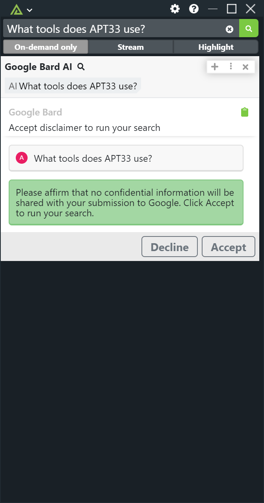
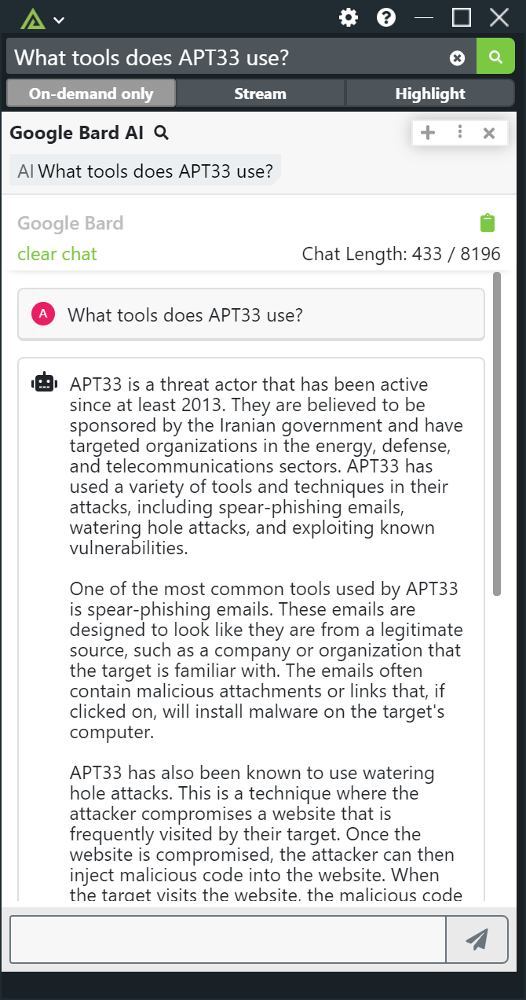
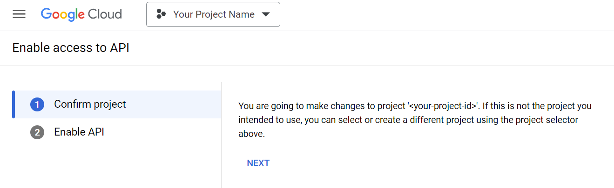
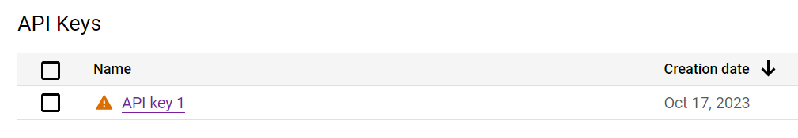
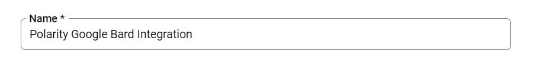
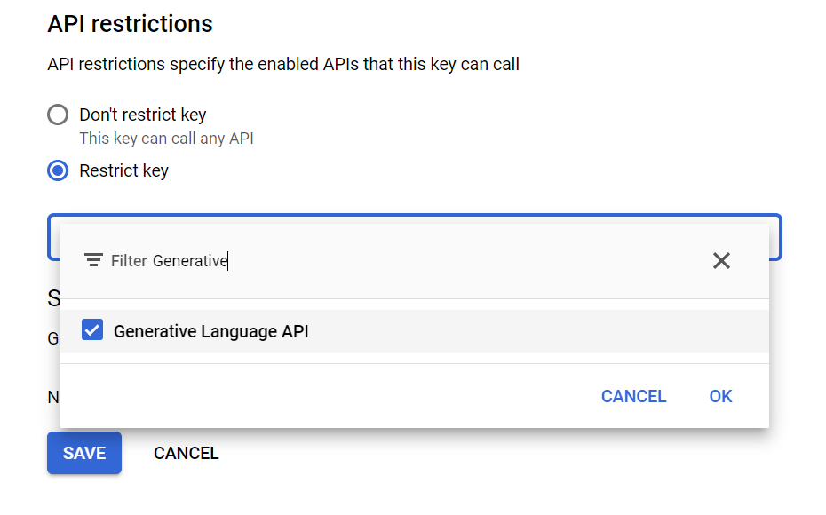

# Polarity Google Gemini AI Integration

This integration leverages Google's Generative Language APIs powered by Google Gemini.

Once configured, you can ask the integration questions by appending a question mark (`?`), to the end of your question when running a Polarity Search.

For more information on Google's Generative Language REST API please see: https://ai.google.dev/api

|  |  
|------------------------------------------------------|-------------------------|
| *Configure a Search Disclaimer*                      | *Chat Example*          |

## Google Gemini AI Integration Options

### Google Cloud API Key

The Google Cloud API Key must have access to Google's Gemini API.  To do this, you must enable the Gemini API on the project associated with the provided API key.

To enable the Gemini API on a project click this link: https://console.cloud.google.com/flows/enableapi?apiid=generativelanguage.googleapis.com

Once the API is enabled on your Project, you can generate an API key by navigating to the "APIs Services" -> "Credentials" page found here: https://console.cloud.google.com/apis/credentials

Click on "Create Credentials" and then select "API key".

Once the key is generated, it will have a generic name such as "API Key 1".  Click on the key name to edit it.

Change the "Name" to something descriptive such as "Polarity Google Gemini Integration".

If you'd like to restrict access to the key by IP address, you can provide your Polarity Server's IP address in the "Set an application restriction" section.

Under "API restrictions" select "Restrict key" and then select "Google Generative Language API" from the dropdown.

> The Gemini API is also referred to as the Generative Language API in the developer console

Click "Save" to apply your changes.

### Google Gemini Language Model

Select the language model to use.  

Gemini 1.5 Pro Latest
https://ai.google.dev/gemini-api/docs/models/gemini#gemini-1.5-pro

Gemini 1.5 Flash Latest
https://ai.google.dev/gemini-api/docs/models/gemini#gemini-1.5-flash

### Show Search Disclaimer

If enabled, the integration will show a disclaimer the user must accept before running a search. 

### Search Disclaimer Content

A disclaimer that users must review before the integration will submit questions to the Google Generative Language API.

### Disclaimer Interval

How often to display the disclaimer to users. Restarting the integration will reset the interval timer.

### Log Searches

If enabled, the integration will log all searches sent to Google including searches where the user did not accept the disclaimer.

## Installation Instructions

Installation instructions for integrations are provided on the [PolarityIO GitHub Page](https://polarityio.github.io/).

## Polarity

Polarity is a memory-augmentation platform that improves and accelerates analyst decision making.  For more information about the Polarity platform please see:

https://polarity.io/
